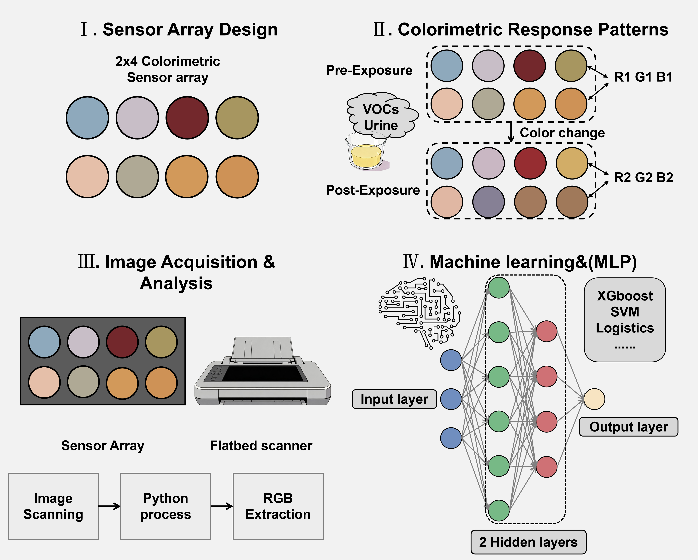

# Gas Sensor

This repository provides an end-to-end workflow for extracting color features from gas sensor images with Meta's Segment Anything Model (SAM), followed by downstream machine learning analysis in Jupyter notebooks.

The main feature extraction pipeline is implemented in `feature_extraction/extract_8_feature.py`. The repository also includes notebooks for MLP, Logistic Regression / Linear SVM, and XGBoost experiments.

## Pipeline Overview



*Figure 1. Overview of the full pipeline used in this project, from image preprocessing and feature extraction to downstream modeling and analysis.*

## Installation

### 1. Create and activate the environment

The recommended setup uses Python 3.9:

```bash
conda create -n sam python=3.9 -y
conda activate sam
```

### 2. Install PyTorch

SAM requires `python>=3.8`, `pytorch>=1.7`, and `torchvision>=0.8`. A CUDA 11.8 installation example is shown below:

```bash
pip install torch==2.0.0 torchvision==0.15.1 torchaudio==2.0.1 --index-url https://download.pytorch.org/whl/cu118
```

If you plan to run on CPU only, replace the command with the appropriate PyTorch installation command from the official website.

### 3. Install SAM and project dependencies

SAM installation should follow the official repository:

- Official repository: https://github.com/facebookresearch/segment-anything

This project includes the official SAM Git installation in `requirement.txt`, so after PyTorch is installed you can run:

```bash
pip install -r requirement.txt
```

To use the environment directly in Jupyter, register it as a kernel:

```bash
python -m ipykernel install --user --name sam --display-name sam
```

### 4. Download SAM checkpoints

`extract_8_feature.py` requires a SAM checkpoint path. The official repository provides the following checkpoints:

- `vit_h`: `https://dl.fbaipublicfiles.com/segment_anything/sam_vit_h_4b8939.pth`
- `vit_l`: `https://dl.fbaipublicfiles.com/segment_anything/sam_vit_l_0b3195.pth`
- `vit_b`: `https://dl.fbaipublicfiles.com/segment_anything/sam_vit_b_01ec64.pth`

Any of the three checkpoints can be used, provided that the selected model fits your available hardware. In practice, `vit_h` is recommended when GPU memory is sufficient.

Example:

```bash
mkdir -p weights/sam_checkpoints
wget -O weights/sam_checkpoints/sam_vit_l_0b3195.pth https://dl.fbaipublicfiles.com/segment_anything/sam_vit_l_0b3195.pth
```

## Repository Structure

Key files in this repository include:

- `feature_extraction/extract_8_feature.py`: main 8-feature extraction pipeline
- `feature_extraction/utils.py`: argument parsing and utility functions
- `mlp.ipynb`: MLP training and SHAP analysis
- `LR_SVM.ipynb`: Logistic Regression and Linear SVM experiments
- `xgboost.ipynb`: XGBoost experiments
- `printer.py`: lightweight logging utility
- `shap_plot.py`: standalone SHAP plotting script

## Input Images

`extract_8_feature.py` recursively scans `--image_dir` and separates images according to whether the directory path contains `before` or `after`. A recommended directory layout is:

```text
image_dir/
├── normal/
│   ├── before/
│   │   ├── 1.jpg
│   │   └── 2.jpg
│   └── after/
│       ├── 1.jpg
│       └── 2.jpg
└── patient/
    ├── before/
    └── after/
```

For an example experiment image, please refer to `images/example.jpg`. Each input image contains eight dye spots with similar sizes, and the pipeline extracts RGB features from these circular dye regions.

Notes:

- The current script supports `.jpg`, `.jpeg`, and `.png` images.
- Filenames should ideally contain exactly one numeric identifier, for example `1.jpg` or `25.png`.
- The script uses the numeric identifier extracted from the filename as the sample `id`.
- `--save_dir` is created automatically if it does not already exist.
- If a relative path is provided for `--save_dir`, it is created under the project root.

## Label File Format

To attach labels to the final `RGB_diff.csv`, provide `--label_file` as a CSV with at least the following columns:

```text
+----+-------+
| id | label |
+----+-------+
| 1  | 0     |
| 2  | 1     |
+----+-------+
```

Where:

- `id` matches the numeric identifier extracted from the image filename
- `label` is the class label, commonly `0` for negative (normal) and `1` for positive (patient)

## Output Structure

The script writes the following outputs under `--save_dir`:

- `masks.../`: filtered SAM masks
- `masks_sorted.../`: sorted masks used for feature extraction
- `visualizations.../`: mask overlays saved on top of the original images when `--visualize_masks true` is enabled
- `values.../`: `RGB_val_before.csv`, `RGB_val_after.csv`, and `RGB_diff.csv`

Common naming patterns:

- default run: `masks/`, `masks_sorted/`, `values/`
- with `--refine true`: `masks_refine/`, `masks_sorted_refine/`, `values_refine/`
- with `--refine true --sample true`: masks remain in `masks_refine/` and `masks_sorted_refine/`, while sampled features are written to `values_sample_refine/`

## Running the Feature Extraction Pipeline

### View available arguments

```bash
python feature_extraction/extract_8_feature.py --help
```

Main arguments:

- `--sam_type`: `vit_h`, `vit_l`, or `vit_b`
- `--sam_weights`: path to the SAM checkpoint
- `--device`: `cuda` or `cpu`
- `--image_dir`: input image directory
- `--save_dir`: output directory; created automatically if missing
- `--label_file`: optional label CSV
- `--refine`: shrink each mask to a smaller circle
- `--generate_masks`: skip SAM inference if sorted masks already exist
- `--sample`: perform repeated random point sampling inside each dye region
- `--visualize_masks`: save mask overlays on the original images
- `--output_name`: custom experiment suffix

`--generate_masks` defaults to `true`.

### What `--refine` does

If `--refine true` is **not** specified, the extracted mask tends to follow the dye region in `images/example.jpg` closely, including the boundary pixels of each dye spot. In practice, these boundary areas may contain uneven staining or edge artifacts, which can introduce bias into the RGB measurements.

If `--refine true` is specified, each mask is contracted to a smaller circle with the same center. This reduces the influence of edge pixels and makes the extracted RGB values more focused on the central dye region.

### What `--sample` does

If `--sample true` is **not** specified, the script computes the RGB mean using all pixels inside each dye mask.

If `--sample true` is specified, the script performs repeated random point sampling inside each dye region and then averages the sampled RGB values across multiple repeats. In the current implementation, each dye is sampled repeatedly with `n_repeats=10`, and the mean across repeats is used as the final output for that dye.

### Full run

Run the full pipeline as follows:

```bash
python feature_extraction/extract_8_feature.py \
  --sam_type vit_l \
  --sam_weights /path/to/sam_vit_l_0b3195.pth \
  --image_dir /path/to/raw_image \
  --save_dir output \
  --label_file /path/to/label.csv \
  --refine true
```

This command will:

1. generate masks with SAM
2. filter and sort the masks
3. extract RGB features from both `before` and `after` images
4. compute `RGB_diff.csv`
5. append labels if `--label_file` is provided

### Save mask visualizations

To export mask overlays for all images:

```bash
python feature_extraction/extract_8_feature.py \
  --sam_type vit_l \
  --sam_weights /path/to/sam_vit_l_0b3195.pth \
  --image_dir /path/to/raw_image \
  --save_dir output \
  --label_file /path/to/label.csv \
  --refine true \
  --visualize_masks true
```

The overlay images will be written to `visualizations.../` under `--save_dir`.

### Reuse existing masks

If `masks_sorted_refine/` already exists, SAM inference can be skipped:

```bash
python feature_extraction/extract_8_feature.py \
  --sam_type vit_l \
  --sam_weights /path/to/sam_vit_l_0b3195.pth \
  --image_dir /path/to/raw_image \
  --save_dir output \
  --label_file /path/to/label.csv \
  --refine true \
  --generate_masks false
```

### Enable sampling mode

To use repeated random sampling instead of averaging over all mask pixels:

```bash
python feature_extraction/extract_8_feature.py \
  --sam_type vit_l \
  --sam_weights /path/to/sam_vit_l_0b3195.pth \
  --image_dir /path/to/raw_image \
  --save_dir output \
  --label_file /path/to/label.csv \
  --refine true \
  --sample true
```

Additional notes:

- repeated sampling is applied independently to each dye region
- the current implementation uses `n_repeats=10`
- the final saved feature is the mean across repeated samplings
- sampled outputs are typically written to `values_sample_refine/`

### Add a custom output suffix

To distinguish multiple experiments:

```bash
python feature_extraction/extract_8_feature.py \
  --sam_type vit_l \
  --sam_weights /path/to/sam_vit_l_0b3195.pth \
  --image_dir /path/to/raw_image \
  --save_dir output \
  --label_file /path/to/label.csv \
  --refine true \
  --output_name exp1
```

This produces directories such as:

- `masks_refine_exp1/`
- `masks_sorted_refine_exp1/`
- `values_refine_exp1/`

## Running the Notebooks

The primary notebooks in the repository are:

- `mlp.ipynb`
- `LR_SVM.ipynb`
- `xgboost.ipynb`

Launch Jupyter from the `sam` environment:

```bash
conda activate sam
jupyter lab
```

Before running a notebook, update the hard-coded `data_path` to point to your local feature file. Typical inputs include:

- `/path/to/output/values_refine/RGB_diff.csv`
- `/path/to/output/values_sample_refine/RGB_diff.csv`
- `data/RGB_diff_refine_label_new.csv`

Notes:

- `LR_SVM.ipynb` and `xgboost.ipynb` aggregate the 24-dimensional RGB features into an 8-dimensional representation inside the notebook.
- `mlp.ipynb` contains both 24-dimensional and 8-dimensional settings; please verify `data_path`, `INPUT_DIM`, and `weight_dir` before training.
- Notebook outputs are generally written under `weights/`.

## Limitations

- The current pipeline assumes that image filenames contain numeric identifiers.
- The quality of SAM masks depends on image quality and the selected checkpoint.
- `--sample true` performs repeated stochastic sampling; although the outputs are averaged, slight variation may still occur across runs.
